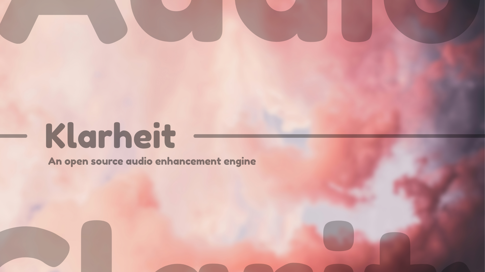

# Klarheit



System-wide audio DSP for Android — one app, one driver.
Studio-grade effects, tuned per device, with Magisk and AOSP ROM
outputs from a single tree.

## Features

| Effect | Description |
| --- | --- |
| Output Volume / Pan / Limiter | Master output gain, channel balance, threshold limit |
| Playback Gain Control | Automatic gain control for consistent loudness |
| LUFS Targeting | Loudness-normalized playback targeting |
| Multiband Compressor | 5-band dynamic range compression |
| FET Compressor | FET-style compression with auto modes |
| Klarheit Bass | Natural / Pure Bass+ / Subwoofer enhancement |
| Klarheit Bass Mono | Mono-summed sub-bass variant |
| Psychoacoustic Bass | Harmonic-based perceived bass boost |
| Klarheit Clarity | Natural / OZone+ / XHiFi presence enhancement |
| Klarheit-DDC | Headset correction via calibration files |
| Spectrum Extension | High-frequency exciter |
| FIR Equalizer | Interpolating EQ, 10/15/25/31 bands |
| Dynamic EQ | Up to 10 bands with per-band dynamics |
| Convolver | Impulse-response convolution (IRS kernels) |
| Field Surround | Soundstage widening surround |
| Differential Surround | Wet/dry differential surround |
| Stereo Imager | 3-band stereo width control |
| Headphone Surround+ | Virtual headphone surround |
| Reverberation | Room simulation reverb |
| Dynamic System | Headphone virtualization + dynamic bass |
| Tube Simulator | 6N1J vacuum-tube coloration |
| AnalogX | Analog warmth stage |
| Auditory Protection | Binaural crossfeed protection |
| Speaker Optimization | Speaker-only correction |

Plus: Material 3 Expressive UI with dynamic color, per-device
profiles with automatic switching, per-app and global modes,
preset import/export, convolver kernels, DDC files, and legacy +
AIDL audio HAL driver support (Android 9–16).

## Project layout

```
Klarheit/
  app/             Klarheit app (package com.klarheit.audio)
  drivers/viper/   DSP driver + Magisk module
  docs/            attribution and import manifests
  presets/         preset files
  Makefile.app     app build (APK -> apk/)
```

## Build

Prerequisites: JDK 17+, Android SDK with platform 37.0 + build-tools 37
(`sdk.dir` in `local.properties`, or `ANDROID_HOME` set).

```bash
make -f Makefile.app debug    # -> apk/Klarheit-<ver>-debug.apk
make -f Makefile.app release  # signed if KEYSTORE_* set in local.properties
make -C drivers/viper libs    # driver .so (arm64-v8a + armeabi-v7a)
make -C drivers/viper zip     # flashable Magisk module zip
```

Install the APK, flash the Magisk module matching your HAL
(non-AIDL vs AIDL), reboot.

## Credits

* Original ViPER4Android: Zhuhang / ViPER520
* Reverse engineering: Martmists, Iscle, likelikeslike
* JamesDSP: james34602

App is GPL-3.0 (`LICENSE`). The DSP core carries its own notice —
personal use only, no commercial use
(`drivers/viper/KlarheitDSP/README.md`).
